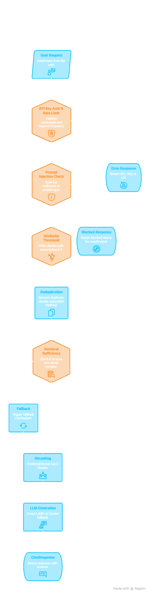

# Production RAG Chatbot — LangChain · Groq · ChromaDB · Observability

**End-to-end Retrieval-Augmented Generation system** with conversational AI,
semantic document search, transaction reward processing, and a full
monitoring and observability pipeline — built with LangChain, Groq LLaMA,
Google Gemini Embeddings, ChromaDB, and FastAPI.


---

## Project Phases

| Phase | Description | Status |
|---|---|---|
| [Phase 1 — RAG Chatbot](/) | LangChain + Groq + ChromaDB + Production Checklist | ✅ Complete |
| [Phase 2 — Monitoring](monitoring/) | Observability + MLOps + CI/CD | 🚧 In Progress |

---

## Table of Contents

- [Overview](#overview)
- [Production Security Checklist](#production-security-checklist)
- [Features](#features)
- [Tech Stack](#tech-stack)
- [Minimum Hardware Requirements](#minimum-hardware-requirements)
- [Project Structure](#project-structure)
- [Installation & Setup](#installation--setup)
- [Configuration](#configuration)
- [Usage](#usage)
- [API Endpoints](#api-endpoints)
- [Example Requests](#example-requests)
- [Architecture](#architecture)
- [Reward Rules](#reward-rules)
- [Roadmap](#roadmap)
- [Contributing](#contributing)
- [Troubleshooting](#troubleshooting)

---

## Overview

A production-ready conversational AI system designed to help loyalty program members understand their rewards. It leverages **Retrieval-Augmented Generation** to combine large language models with curated policy documents, ensuring accurate, citation-backed responses.

The system supports:
- **Multi-user sessions** with conversation memory
- **Transaction analysis** with automatic point calculation
- **Intelligent retrieval** using semantic search via ChromaDB
- **Flexible LLM selection** with automatic fallback mechanisms
- **Production-grade security** with a complete 7-point RAG safety checklist

---

## Production Security Checklist

All 7 production RAG checklist items implemented and tested:

| # | Check | Layer | Implementation |
|---|---|---|---|
| 1 | **Prompt Injection Protection** | LLM Security | 13 regex patterns + input sanitization (`security.py`) |
| 2 | **Access Control** | API Security | API key auth + rate limiting 20 req/min (`access_control.py`) |
| 3 | **Similarity Thresholding** | Retrieval Correctness | Min score 0.3 — drops irrelevant chunks (`vector_store.py`) |
| 4 | **Retrieval Sufficiency** | Retrieval Correctness | Graceful fallback when context is insufficient (`chain.py`) |
| 5 | **Deduplication** | Context Quality | MD5 hash-based duplicate chunk removal (`chain.py`) |
| 6 | **Metadata Filtering** | Context Quality | Optional `doc_filter` to target specific documents (`chain.py`) |
| 7 | **Reranking** | Performance | FlashrankRerank cross-encoder reordering (`chain.py`) |

---

## Features

- 🔒 **Prompt Injection Defense** — 13 regex patterns block instruction overrides, persona hijacks, jailbreaks
- 🛡️ **API Key Authentication** — All protected endpoints require `X-API-Key` header
- ⏱️ **Rate Limiting** — In-memory sliding window, 20 requests per minute per key
- 🎯 **Similarity Thresholding** — Minimum score cutoff prevents irrelevant chunks reaching the LLM
- 📋 **Retrieval Sufficiency** — Graceful fallback response when context is too thin
- 🔁 **Deduplication** — MD5 hash-based removal of duplicate chunks before generation
- 🗂️ **Metadata Filtering** — Target `rewards_policy` or `terms_conditions` documents per query
- 🏆 **Reranking** — FlashrankRerank cross-encoder reorders chunks by true relevance
- 🤖 **RAG-Powered Chatbot** — Answers grounded in actual policy documents with citations
- 💬 **Conversation Memory** — Per-session history with configurable window size
- 💰 **Transaction Processing** — Points calculation with category-based multipliers
- 🔄 **Multi-Model Support** — Groq LLaMA (primary) with Google Gemini fallback
- 🧠 **Semantic Search** — ChromaDB with Gemini embeddings + MMR diversity
- 🚀 **FastAPI REST API** — Async, typed endpoints with Pydantic validation

---

## Tech Stack

### Core Framework
- **Python 3.10+**
- **FastAPI 0.136+** — Modern async web framework
- **Uvicorn 0.47+** — ASGI server

### AI & NLP
- **LangChain 1.3+** — LLM orchestration and RAG pipeline
- **LangChain Groq 1.1+** — Groq LLaMA integration (primary chat)
- **LangChain Google GenAI 4.2+** — Gemini embeddings
- **LangChain Classic 1.0+** — Stable chain components
- **ChromaDB 1.5+** — In-process vector database
- **FlashrankRerank** — CPU-friendly cross-encoder reranking

### Security
- **FastAPI Security** — API key header scheme
- **Regex-based injection detection** — 13 patterns across 6 attack categories
- **In-memory rate limiter** — Sliding window per API key

### Data & Validation
- **Pydantic 2.13+** — Request/response validation
- **LangChain Text Splitters 1.1+** — Document chunking
- **Docx2txt 0.8** — Word document parsing

### Utilities
- **Python-dotenv 1.2+** — Environment variable management
- **HTTPx 0.28+** — Async HTTP client

---

## Minimum Hardware Requirements

| Component | Minimum | Recommended |
|---|---|---|
| **CPU** | Dual-core 1.8 GHz | Quad-core 2.5 GHz+ (e.g. i7-10510U) |
| **RAM** | 4 GB | 8 GB+ |
| **Storage** | 2 GB free | 5 GB free |
| **OS** | Windows 10 / macOS 11 / Ubuntu 20.04 | Windows 11 / macOS 13 / Ubuntu 22.04 |
| **Python** | 3.10 | 3.12 |
| **Internet** | Required | Stable broadband |

> **No GPU required.** All LLM inference runs via Groq/Gemini APIs. ChromaDB and FlashrankRerank run in-process on CPU — no Docker or external services needed.

### RAM Usage Breakdown

| Component | Approx. RAM |
|---|---|
| Python + FastAPI | ~150 MB |
| ChromaDB in-process | ~200 MB |
| LangChain + dependencies | ~300 MB |
| FlashrankRerank model | ~100 MB |
| OS overhead | ~1 GB |
| **Total active** | **~1.75 GB** |

---

## Project Structure

```
rag-chatbot-langchain-observability/
├── main.py                        # FastAPI app, routes, session management
├── test_chatbot.py                # CLI demo and interactive REPL
├── requirements.txt               # Pinned Python dependencies
├── .env                           # API keys (never committed)
├── .env.example                   # Template for required keys
├── .gitignore
├── README.md
│
├── app/
│   ├── __init__.py
│   ├── config.py                  # All settings, thresholds, reward rules
│   ├── models.py                  # Pydantic request/response schemas
│   ├── prompts.py                 # Centralized prompt templates
│   ├── security.py                # Prompt injection detection engine
│   ├── access_control.py          # API key auth + rate limiting
│   ├── llm.py                     # LLM init with Groq/Gemini fallback
│   ├── chain.py                   # RAGChatSession — full production pipeline
│   ├── vector_store.py            # ChromaDB setup, ingestion, threshold retrieval
│   └── rewards.py                 # Points calculation engine
│
├── Docs/                          # Policy documents (.docx)
│   ├── RewardPlus_Rewards_Policy.docx
│   └── RewardPlus_Terms_and_Conditions.docx
│
├── assets/
│   └── pipeline.png                   # 7-stage RAG pipeline diagram
│
└── chroma_db/                         # Auto-generated vector index (not committed)
```

---

## Installation & Setup

### Prerequisites

- Python 3.10+
- **Windows only:** Microsoft C++ Build Tools (required for ChromaDB)
  - Download: https://visualstudio.microsoft.com/visual-cpp-build-tools/
  - Select: **Desktop development with C++** workload
- API keys for Google (embeddings) and Groq (chat)

### Step 1 — Clone the Repository

```bash
git clone https://github.com/haswanth13901/RAG-chatbot-LangChain-observability.git
cd RAG-chatbot-LangChain-observability
```

### Step 2 — Create Virtual Environment

```bash
python -m venv .venv

# Windows
.venv\Scripts\activate

# macOS / Linux
source .venv/bin/activate
```

### Step 3 — Install Dependencies

```bash
pip install --upgrade pip
pip install -r requirements.txt
```

### Step 4 — Configure Environment Variables

```bash
cp .env.example .env
```

Edit `.env`:
```env
GOOGLE_API_KEY=your_google_api_key_here
GROQ_API_KEY=your_groq_api_key_here
APP_API_KEY=your_app_api_key_here
```

Get your free API keys:
- Google: https://aistudio.google.com/apikey
- Groq: https://console.groq.com

`APP_API_KEY` is your own key that clients must send in the `X-API-Key` header to access protected endpoints. Set it to any secure string.

### Step 5 — Add Policy Documents

```
Docs/
├── RewardPlus_Rewards_Policy.docx
└── RewardPlus_Terms_and_Conditions.docx
```

The server automatically loads, chunks, and embeds these on startup.

---

## Configuration

All settings in `app/config.py`:

| Variable | Default | Description |
|---|---|---|
| `GROQ_CHAT_MODEL` | `llama-3.1-8b-instant` | Primary chat model |
| `GEMINI_CHAT_MODEL` | `gemini-2.0-flash` | Fallback chat model |
| `EMBED_MODEL` | `gemini-embedding-2-preview` | Embedding model (always Gemini) |
| `MEMORY_WINDOW` | `10` | Conversation turns kept per session |
| `RETRIEVAL_K` | `4` | Policy chunks retrieved per query |
| `SIMILARITY_THRESHOLD` | `0.3` | Minimum score to pass retrieval (0.0–1.0) |
| `MIN_RELEVANT_CHUNKS` | `1` | Minimum chunks needed to generate an answer |
| `RERANK_TOP_N` | `3` | Top chunks kept after reranking |
| `RATE_LIMIT_REQUESTS` | `20` | Max requests per window per API key |
| `RATE_LIMIT_WINDOW_SECONDS` | `60` | Rate limit window in seconds |
| `DOCS_DIR` | `./Docs` | Policy documents folder |
| `CHROMA_DIR` | `./chroma_db` | Vector index path |

### LLM Priority

```
1. Groq  (llama-3.1-8b-instant) ← primary   — 14,400 free req/day
2. Gemini (gemini-2.0-flash)    ← fallback  —  1,500 free req/day
3. RuntimeError                 ← no keys set
```

Gemini is always used for embeddings regardless of which model handles chat.

---

## Usage

### Start the Server

```bash
# Development
uvicorn main:app --reload --port 8000

# Production
uvicorn main:app --host 0.0.0.0 --port 8000 --workers 4
```

- Server: `http://localhost:8000`
- Swagger UI: `http://localhost:8000/docs`

### Authenticate in Swagger

Click the 🔒 **Authorize** button → enter your `APP_API_KEY` value → all requests will include the key automatically.

### Test the Chatbot

```bash
# Full demo — 4 scenes, all transaction types
python test_chatbot.py

# Interactive REPL — type questions live
python test_chatbot.py --interactive
```

---

## API Endpoints

### `POST /chat` 🔒
Send a message in a conversation session. Supports optional document filtering.

**Request:**
```json
{
  "session_id": "user-123",
  "message": "How many points do I earn on groceries?",
  "doc_filter": "rewards_policy"
}
```

`doc_filter` is optional. Valid values: `rewards_policy`, `terms_conditions`, `null` (searches all).

**Response:**
```json
{
  "session_id": "user-123",
  "answer": "Per Section 2 of our Rewards Policy, groceries earn a 2x multiplier — 20 points per dollar...",
  "sources": ["RewardPlus_Rewards_Policy.docx"],
  "timestamp": "2026-05-21T14:32:00Z",
  "doc_filter": "rewards_policy"
}
```

### `POST /transaction/reward` 🔒
Process a transaction and get points calculation with natural language explanation.

**Request:**
```json
{
  "session_id": "user-123",
  "transaction_id": "txn-456",
  "user_id": "user-123",
  "type": "purchase",
  "amount": 150.00,
  "category": "dining",
  "merchant": "Restaurant XYZ"
}
```

**Valid transaction types:** `purchase` `transfer` `bill_payment` `referral` `subscription`

**Response:**
```json
{
  "transaction_id": "txn-456",
  "points_earned": 4500,
  "multiplier_applied": 3.0,
  "reward_tier": "dining",
  "chatbot_explanation": "You earned 4,500 points — $150 × 10 base × 3x dining multiplier...",
  "sources": ["RewardPlus_Rewards_Policy.docx"],
  "timestamp": "2026-05-21T14:32:00Z"
}
```

### `DELETE /chat/{session_id}` 🔒
Clears conversation memory for a session (call on user logout).

### `GET /health`
Returns system status, active model info, and key availability. Public endpoint — no auth required.

```json
{
  "status": "ok",
  "chunks_indexed": 18,
  "active_sessions": 0,
  "chat_model": "llama-3.1-8b-instant",
  "embed_model": "gemini-embedding-2-preview",
  "google_key": true,
  "groq_key": true
}
```

### `GET /rewards/rules`
Returns the full reward rules table as JSON. Public endpoint — no auth required.

> 🔒 = requires `X-API-Key` header

---

## Example Requests

### cURL

```bash
# Chat with auth
curl -X POST "http://localhost:8000/chat" \
  -H "Content-Type: application/json" \
  -H "X-API-Key: your-app-api-key" \
  -d '{"session_id": "demo", "message": "What is the dining multiplier?"}'

# Chat with metadata filter
curl -X POST "http://localhost:8000/chat" \
  -H "Content-Type: application/json" \
  -H "X-API-Key: your-app-api-key" \
  -d '{"session_id": "demo", "message": "What are my legal rights?", "doc_filter": "terms_conditions"}'

# Transaction
curl -X POST "http://localhost:8000/transaction/reward" \
  -H "Content-Type: application/json" \
  -H "X-API-Key: your-app-api-key" \
  -d '{"session_id": "demo", "transaction_id": "t-001", "user_id": "u-001", "type": "purchase", "amount": 50.00, "category": "groceries", "merchant": "Whole Foods"}'

# Health (no auth)
curl "http://localhost:8000/health"

# Clear session
curl -X DELETE "http://localhost:8000/chat/demo" \
  -H "X-API-Key: your-app-api-key"
```

### Python

```python
import httpx, asyncio

HEADERS = {"X-API-Key": "your-app-api-key"}

async def ask():
    async with httpx.AsyncClient() as client:
        r = await client.post(
            "http://localhost:8000/chat",
            json={
                "session_id": "py-user",
                "message": "Do I earn points on bill payments?",
                "doc_filter": "rewards_policy"
            },
            headers=HEADERS,
        )
        print(r.json()["answer"])

asyncio.run(ask())
```

---

## Architecture

## 7-Stage Production RAG Pipeline — From Security to Generation



### Key Components

| Component | File | Purpose |
|---|---|---|
| API Layer | `main.py` | HTTP routing, session management |
| Security | `app/security.py` | Injection detection, input sanitization |
| Access Control | `app/access_control.py` | API key auth, rate limiting |
| Prompts | `app/prompts.py` | Centralized prompt templates |
| RAG Pipeline | `app/chain.py` | Full 7-stage production pipeline |
| Vector Store | `app/vector_store.py` | ChromaDB, ingestion, threshold retrieval |
| LLM | `app/llm.py` | Groq/Gemini init with fallback |
| Reward Engine | `app/rewards.py` | Points calculation logic |
| Config | `app/config.py` | All settings, thresholds, reward rules |
| Models | `app/models.py` | Pydantic request/response schemas |

---

## Reward Rules

| Type | Base Rate | Bonus Categories |
|---|---|---|
| **Purchase** | 10 pts/$ | 🛒 Groceries 2x · 🍽️ Dining 3x · ✈️ Travel 5x · 📱 Electronics 1.5x |
| **Transfer** | 2 pts/$ | None |
| **Bill Payment** | 5 pts/$ | 💡 Utilities 1.5x · 🛡️ Insurance 2x |
| **Referral** | 500 pts flat | One-time per referred user |
| **Subscription** | 8 pts/$ | 🎬 Streaming 2x |

### Example Calculations

```
$100 Grocery Purchase  = $100 × 10 × 2x  = 2,000 points
$50  Dining            = $50  × 10 × 3x  = 1,500 points
$25  Streaming         = $25  × 8  × 2x  =   400 points
     Referral bonus    = 500 points flat
```

---

## Roadmap

- [ ] **Phase 2** — Monitoring & Observability (latency p50/p95/p99, token usage, CI/CD)
- [ ] RAGAS evaluation pipeline for retrieval quality scoring
- [ ] MLflow experiment tracking
- [ ] GitHub Actions CI/CD pipeline
- [ ] PostgreSQL backend for persistent sessions
- [ ] BM25 hybrid search (keyword + semantic)
- [ ] Admin panel for managing reward rules without code changes
- [ ] Automated test coverage to 90%+

---

## Contributing

1. Fork the repository
2. Create a feature branch: `git checkout -b feature/your-feature`
3. Commit your changes: `git commit -m 'feat: your feature description'`
4. Push: `git push origin feature/your-feature`
5. Open a Pull Request

**Guidelines:** Follow PEP 8 · Add docstrings · Test all endpoints · Update `requirements.txt` if adding deps

---

## Troubleshooting

| Issue | Fix |
|---|---|
| `GOOGLE_API_KEY not found` | Add key to `.env` in project root |
| `No .docx files found` | Add policy files to `Docs/` folder |
| `ChromaDB corrupted` | Delete `chroma_db/` and restart |
| `429 RESOURCE_EXHAUSTED` | Gemini quota hit — Groq handles chat automatically |
| `401 Unauthorized` | Add `X-API-Key` header to your request |
| `403 Forbidden` | Wrong API key — check `APP_API_KEY` in `.env` |
| `429 Too Many Requests` | Rate limit hit — wait 60 seconds and retry |
| `chroma-hnswlib build error` | Install Microsoft C++ Build Tools (Windows) |
| `ModuleNotFoundError` | Run `pip install -r requirements.txt` inside `.venv` |
| `Out of memory` | Close other apps — need ~1.75 GB free RAM |
| `[SECURITY] Blocked` | Input triggered injection detection — rephrase question |
| `[SUFFICIENCY] Insufficient context` | Question too vague or off-topic — try rephrasing |

---

**Built with ❤️ as a production RAG learning project — Phase 2 MLOps coming soon**